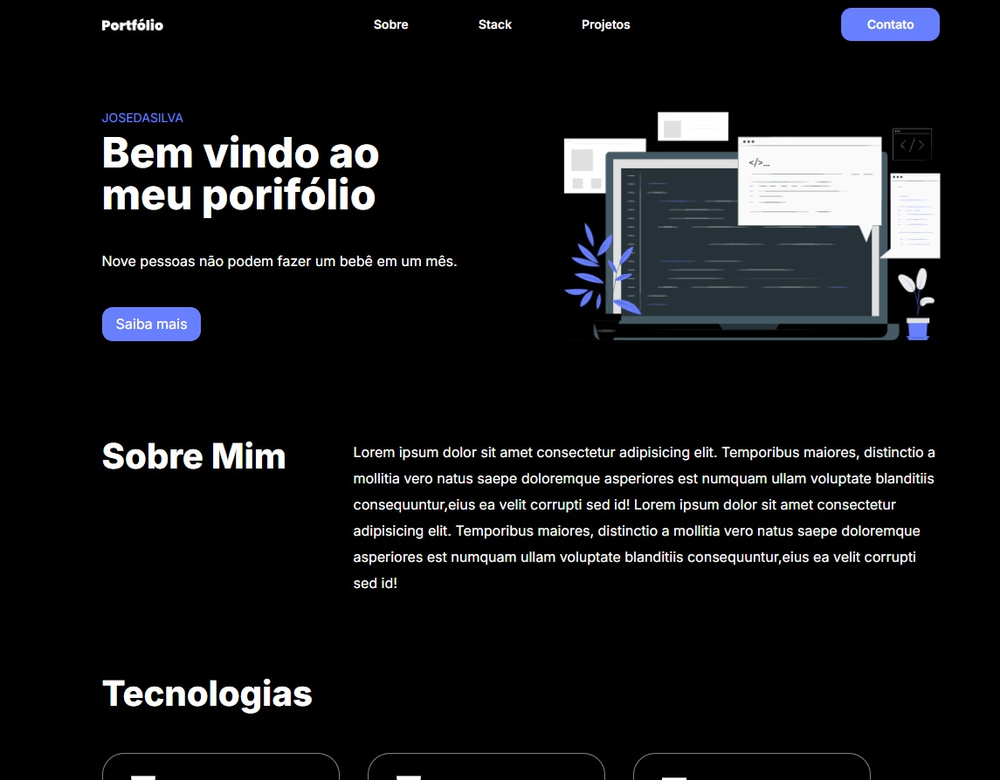

# ⚛️ Projeto: Portfólio em React

Este projeto foi desenvolvido como parte da formação na Kenzie Academy e tem como objetivo a construção de um portfólio utilizando React. A aplicação apresenta tecnologias e projetos renderizados dinamicamente com base em dados fornecidos, além de uma estrutura de componentes clara e organizada.

---

## 📋 Descrição

O projeto consiste em um portfólio pessoal construído com React, incluindo:

- Estrutura de componentes organizada por seções;
- Listas de tecnologias e projetos renderizadas dinamicamente com `.map()`;
- Estilização baseada em um modelo no Figma;
- Uso de imagens da pasta `assets`;
- Estilização com **CSS Modules**;

---

## 🚀 Tecnologias Utilizadas

- ReactJs
- JavaScript (ES6)
- CSS Modules
- Vite

---

## 🧱 Estrutura de Componentes

A aplicação foi dividida em componentes de forma modular e reutilizável:

- `Header`
- `Banner`
- `AboutMe`
- `TechList`
- `ProjectList`
- `Footer`

Cada componente é responsável por uma seção do layout, facilitando manutenção e escalabilidade.

---

## 🖼️ Capturas de Tela



## 🖥️ Clonar o Projeto

1. Clone o repositório:

   ```bash
   git clone https://github.com/dkrausz/portifolio-kenzie.git
   ```

2. Abra a pasta do projeto:

   ```bash
    cd portifolio-kenzie
   ```

3. Execute o comando

   ```bash
    npm run dev
   ```

## 🔗 Acesso ao Projeto

- Repositório GitHub: [https://github.com/dkrausz/portifolio-kenzie](https://github.com/dkrausz/portifolio-kenzie)
- Vercel Page: [https://m3-s1-entrega-portfolio-template-dkrausz-edwrr4jgj.vercel.app/](https://m3-s1-entrega-portfolio-template-dkrausz-edwrr4jgj.vercel.app/)

---

## 📝 Licença

Este projeto é de uso educacional e não possui uma licença específica.
